# Demo

The `demo.gif` in the project README is generated on-demand using the `demo` workflow.

**To generate**: `gh workflow run demo.yml -f pr_number=<PR_NUMBER>` or use the Actions tab → "demo" → "Run workflow".

## How It Works

- **[demo-setup.sh](demo-setup.sh)** - Builds the CLI executable and creates a demo environment. Run from the repo root:
  ```sh
  docs/demo-setup.sh
  ```
- **[demo.tape](demo.tape)** - A [VHS](https://github.com/charmbracelet/vhs) script that records a terminal session as a GIF.

## Pitfalls of Writing to Pull Requests

The demo workflow needs to run on a pull request and write to the same PR branch. This introduces 3 interconnected challenges:

1. **Triggering workflow runs**. By [design](https://docs.github.com/en/actions/how-tos/write-workflows/choose-when-workflows-run/trigger-a-workflow#triggering-a-workflow-from-a-workflow), a commit by GitHub Actions's token cannot trigger a workflow (directly or indirectly) to prevent infinite loops. But most repo's branch protection rules require checks to pass on the latest commit.
2. **Circular workflow dispatch**. If we can solve #1, then we must protect against a new commit being pushed to the PR branch triggering the same workflow again, creating a loop.
3. **Arbitrary code execution**. If we can solve #1 and #2, then we need to protect against the workflow running untrusted code from the PR, while still permitting the workflow to write the generated files to the PR branch.

### Solution to #1: Triggering workflow runs

The workflow uses a GitHub App and the `actions/create-github-app-token` action to [create a token](https://docs.github.com/en/apps/creating-github-apps/authenticating-with-a-github-app/making-authenticated-api-requests-with-a-github-app-in-a-github-actions-workflow#authenticating-with-a-github-app) for committing to the PR branch.

### Solution to #2: Protecting against circular workflow dispatch

The demo workflow uses the `workflow_dispatch` trigger, which can only be invoked manually (via CLI or Actions tab). This eliminates circular triggers entirely.

### Solution to #3: Mitigating arbitrary code execution

The demo workflow must protect against a [pwn request](https://securitylab.github.com/resources/github-actions-preventing-pwn-requests/) attack. This vulnerability arises from the combination of two risk factors:
- **Untrusted input**: any malicious actor could trigger the workflow on a PR branch, causing the workflow to execute untrusted code
- **Privileged execution environment**: The default `actions/checkout` persists credentials to disk (`persist-credentials: true`), making the write-capable token available to any subsequent step. The workflow also has access to the `CI_BOT_APP_ID` and `CI_BOT_APP_PRIVATE_KEY` secrets. These are vulnerable to exfiltration and abuse.

This is a common attack pattern known as a "pwn request". See the GitHub Security Lab series on this class of vulnerability ([Part 1](https://securitylab.github.com/resources/github-actions-preventing-pwn-requests/), [Part 2](https://securitylab.github.com/research/github-actions-untrusted-input/), [Part 3](https://securitylab.github.com/research/github-actions-building-blocks/), [Part 4](https://securitylab.github.com/resources/github-actions-new-patterns-and-mitigations/)) for more details. GitHub's default PR security has mitigations to prevent this for `pull_request` workflows by disabling write permissions. But for PRs that need additional write permissions (e.g., to commit the generated GIF), it's important to implement additional protections.

The demo workflow uses `workflow_dispatch`, which can [only be triggered](https://docs.github.com/en/actions/writing-workflows/choosing-when-your-workflow-runs/events-that-trigger-workflows#workflow_dispatch) by users with write access to the repository. This eliminates the untrusted input vector. There is no scenario where an unprivileged user can trigger the workflow.

```mermaid
sequenceDiagram
    participant U as Collaborator<br/>(write access)
    participant D as demo.yml<br/>workflow_dispatch<br/>🔓 contents: write + secrets

    U->>D: gh workflow run -f pr_number=N
    Note over D: Checks out PR code (by SHA)<br/>Generates GIF via VHS<br/>Commits to PR branch (app token)<br/>Posts sticky PR comment
    D-->>U: PR comment with demo GIF
```



#### `demo.yml`

- Triggered by `workflow_dispatch` with a `pr_number` input — only invocable by users with write access to the repository
- Checks out the PR by commit SHA to avoid TOCTOU issues
- Uses the GitHub App token for checkout and push (to trigger downstream CI workflows on the new commit)
- Generates the demo GIF and commits it to the PR branch
- Posts a sticky PR comment with the generated GIF
